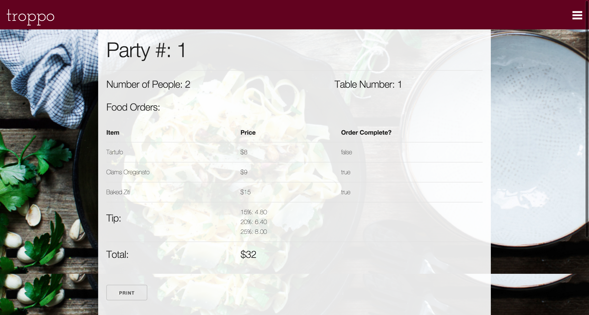

HEROKU APPLICATION:
https://arcane-oasis-34382.herokuapp.com

USER STORIES:
A restaurant would use this app to give to their servers. A server would create an account to start. They then have the ability to add parties and add orders to those particular parties. A server can keep track of what orders have been completed by the kitchen. I have a separate login for admin which only has the ability edit the menu. At the end of the order, the server can print the final receipt with tip recommendations.

EXPLAINATION OF TECHNOLOGIES:
I used Ruby on rails for a bulk of the work. I also used HTML/CSS for styling and some javascript for animations

APPROACH:
I started with an ERD of how the tables and associations should look. I set up all my CRUD actions and user login abilities. I set up my main functionality and then did my styling.

SCREENSHOTS:

